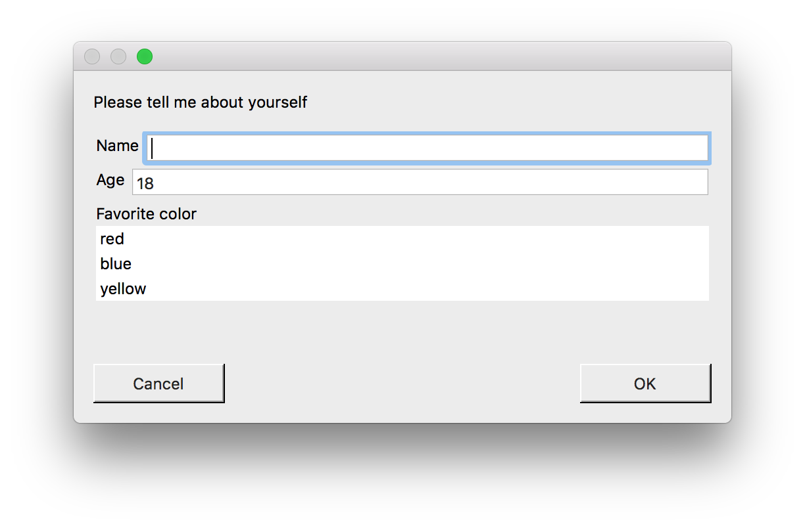
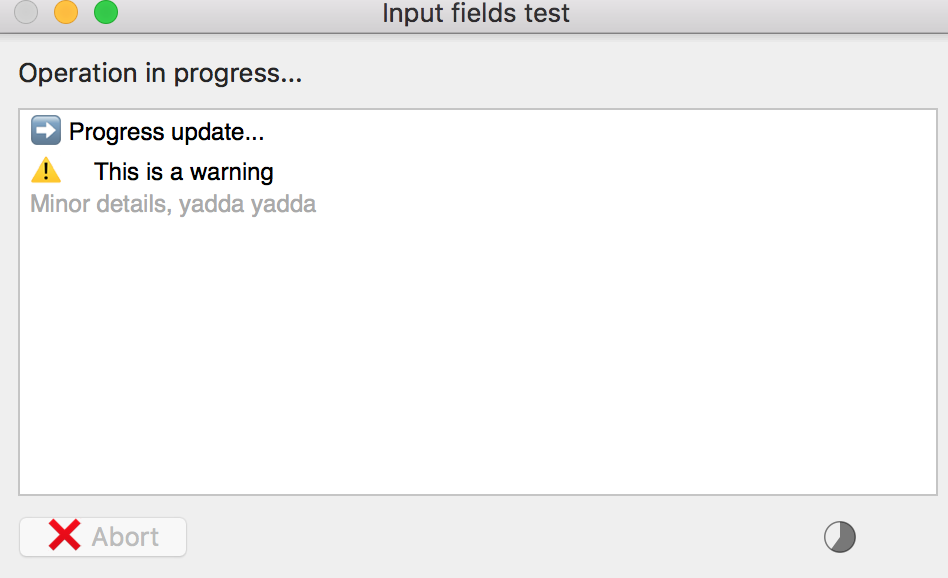

#  Easy Dialogs

_EasyDialogs_ simplifies the task of programmatically creating forms and input dialogs on _macOS_.

The focus is on ease of use for the developer rather than customization or beautiful controls. As such, the intended use is for the quick creation of internal tools rather than consumer applications. But don't let me stop you if that's your goal :-)

This library provides input dialogs for text, numbers, dropdown, multiple selection and more. All controls are intended to be created programmatically, i.e. without using interface builder.

## Threading model

The library is built with the assumption that it will be manipulated from the main thread. Using the library from another thread is not supported (i.e. the library accesses and updates UI elements extensively).

## Overview of features

- [Form input controls](#form-input-controls)
    - [Controls catalogue](#input-controls-catalogue)
- [Autogenerated forms](#autogenerated-forms)
- [Form dialogs](#form-dialogs)
- [Progress dialogs](#progress-dialogs)

## Form input controls

Form input controls are used to create the view and the logic needed to handle a form input field. All inputs are subclass of `ValueInput`.

### Views and how to integrate them

Subclasses of `ValueInput` are a `NSView` that contains the control view itself (e.g. a `NSTextView`), a label view and potentially other accessory views (such as scrollbars or extra buttons) needed to achieve the control functionality.

To integrate a `ValueInput` in your view hierarchy, just add the `ValueInput` itself as a subview.

### Setting and getting input the value

Each `ValueInput` has a `value` property of the type appropriate for the input control (e.g. a `Int` for `TextFieldInput<Int>`).

The value can be read and set using this property at any time, but only from the main thread. Setting the value will immediately update the input control.

### Input validation

Each `ValueInput` supports validation rules. The property `hasValidInput` can be queried to check the current status of the input control.

Some validation rules come with the library (e.g. `NotNil`, `NotEmptyString`, `NotEmptySequence`) and some are already hardcoded in specific controls (e.g. a `TextFieldInput<Int>` will consider any string input that does not represent an integer as a non-valid input).

To add custom validation rules, use the validation rule `Validation.Custom`, which accepts a closure that will perform the validation.

### Input controls catalogue

#### `TextViewInput`


A multiline string input that is rendered as a text view with scrollbars.

#### `TextFieldInput`


A generic class that supports `Int`, `UInt`, `String` and `URL` out of the box. Additional types can be added by making the type conform to the `StringInputConvertible` protocol. The input is rendered as a single-line text input.


#### `SingleSelectionInput`


A generic class that allows to select a single object from a list of objects. The input is rendered as a drop down.

#### `MultipleSelectionInput`


A generic class that allows to select zero, one or more objects from a list (internally rendered as a scrollable table). User can select multiple objects using the `Shift` or `Command` key on their keyboard when clicking on them, as in the usual _macOS_ selection paradigm (e.g. when selecting files in _Finder_).


#### `ObjectListInput`


A generic class that allows to add or remove objects from a list. Objects can be edited or created on the fly. This is achieved using property bindings, discussed in the [autogenerated forms](#autogenerated-forms) section.

## Autogenerated forms


Autogenerated forms allow for creation and editing of objects without writing boilerplate code for the form itself. To achieve this result, an object properties must be mapped to input fields using bindings.

A binding defines how a property of an object should be represented as an input field. Bindings are specified inside a `BindingsFactory`, which is a collection of closures that generate bindings. The use of closures and type erasure is not by API design but by necessity; hopefully this can be simplified in future iterations.

The syntax and type system is a bit convoluted, so it's easier to follow an example. In the following example, bindings are defined for a `Ingredient` object.

```swift
class Ingredient {
    let name: String
    let amount: UInt
}
```
In defining the bindings, the factory has two closures, one that generate a binding from `name` to a `TextFieldInput<String>`, and one that generates a binding from `amount` to a `TextFieldInput<UInt>`.


```swift
let factory = BindingsFactory<Ingredient>(
    {
        PropertyInputBinding(
            \Ingredient.name,
            TextFieldInput<String>(label: "Name")
        ).any
    },
    {
        PropertyInputBinding(
            \Ingredient.amount,
            TextFieldInput<UInt>(label: "Amount")
            ).any
    }
)
```
## Form dialogs



Form dialogs can easily be created using the `FormWindow.displayForm(...)` method. When invoked, the method will create a top-level modal window that presents the inputs passed to the method.

The displayed forms has two buttons, `OK` and `Cancel`. On clicking `OK`, all form input controls are checked for valid input. If any input fails validation, the form is not dismissed and an error is displayed. 


## Progress dialogs


Progress dialogs can be displayed using `ProgressDialog.showProgress(...)`. A progress dialog will be displayed as a modal sheet on top of the given window.

This method immediately returns a `ProgressMonitor`, which can be used to update the progress dialog.

Updates to the progress dialog can be invoked from any thread; in fact, it only makes sense to use this dialog if the work that generates progress update is run on a background thread. Performing that work on the main thread will cause the UI not to update until the work is completed.

The progress dialog presents an indefinite activity indicator, that will be replaced by a "Done" button once the work is completed. The dialog is notified that the work is completed when the `done` method of the `ProgressMonitor` is invoked.

The first time the `updateProgress(...)` metod is invoked on `ProgressMonitor`, the activity indicator will turn into a definite indicator.

Detailed logs about the operation can be added to the progress dialog using `appendLog(...)`. This accepts either a `NSAttributedString`, a `String` or `Any`. When using `String` or `Any`, a "style" can be used that will apply some formatting to the string based on predefined styles.
